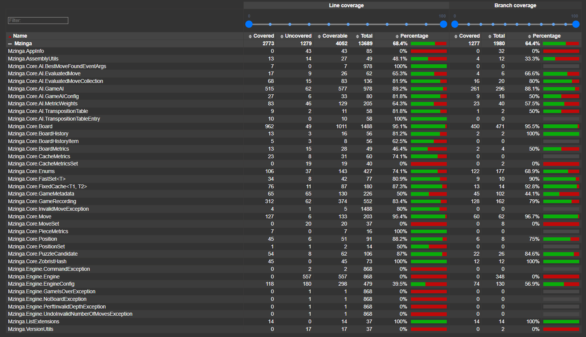
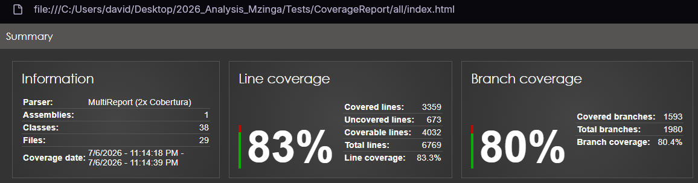
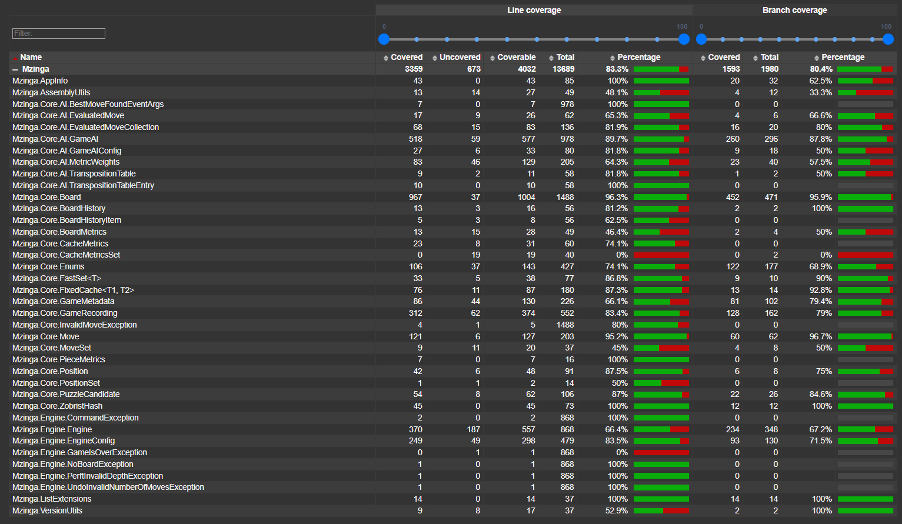

# **Mzinga project analysis report**

## **Unit testing and code coverage**

The **Mzinga** project utilizes the **MSTest** framework for its existing unit tests. Alongside the test framework, **Coverlet** is integrated as a cross-platform code coverage library for .NET. 

To streamline the execution and reporting of unit tests, a PowerShell script `run_tests.ps1` was created in the `Tests` directory. This script automates test discovery, runs tests with Coverlet code coverage data collection, and generates an HTML visual report using **ReportGenerator**.

The script accepts the following arguments:
- **`Target`**: Indicates which context of tests to evaluate. Results and reports are separately cached under `Results/{Target}` and `CoverageReport/{Target}` directories.
  - `original`: Evaluates only existing unit tests located in the `Mzinga/src` folder.
  - `new`: Evaluates only the new tests located in the `Tests` folder.
  - `all` (default): Evaluates both original and new tests.
- **`-Visualize`**: Generates an HTML coverage report based on the selected target's results and opens it in the browser.
- **`-Rerun`**: Deletes the previous results and runs them from scratch. By default, the script skips test execution if results already exist for the selected target.
- **`-Clean`**: Deletes all test results and coverage reports for all targets. If provided, all other arguments are ignored.

### **Current coverage baseline**

Before introducing additional unit tests to the codebase, it is crucial to establish the current test coverage baseline. We will run only the original tests and generate the visual report:

```powershell
.\Tests\run_tests.ps1 original -Visualize
```

[Image 1](#img1) displays general code coverage results, before introducing new tests. We can see that around two thirds of lines (68%) and branches (64%) are covered, which is a good start but can be improved.

<figure id="img1" style="text-align: center;">
  
  <figcaption>Image 1: Original code coverage general results</figcaption>
</figure>

[Image 2](#img2) shows detailed code coverage by main classes. We can see that main game and AI logic are covered with high coverage percentage. This includes `Mzinga.Core.Board` which covers board state, `Mzinga.Core.Move` which validates and executes moves, `Mzinga.Core.AI.GameAI` which implements algorithms for game AI, as well as some classes with 100% code coverage such as `PieceMetrics`.

On the other hand, there are classes that are not covered as much or not covered at all. The goal is to reach over 80% total code coverage. To achieve this, testing should focus on the following areas:

1. `Mzinga.Engine` namespace: Class `Mzinga.Engine.Engine` is not covered at all. Testing basic interactions, Universal Hive Protocol commands, and engine states is important. Furthermore, `Mzinga.Engine.EngineConfig` is only covered by 39.5%. Testing the parsing of default options, validations, and profile configs will also provide a significant coverage bump.
2. `Exception` classes: Exception classes such as `CommandException`, `GameOverException`, `NoBoardException` `PerfInvalidDepthException`, and `UndoInvalidNumberOfMovesException` have 0% coverage. This clearly shows that error handling and invalid state edge cases are currently not being verified by the test suite.
3. Core components with partial coverage: Classes like `Mzinga.Core.GameMetadata` (50% coverage) and `Mzinga.Core.AI.MetricWeights` (64.3% coverage) have gaps that are not tested.
4. Utility classes: Simple utility structures like `Mzinga.AppInfo`, `Mzinga.VersionUtils`, `Mzinga.Core.CacheMetricsSet` and `Mzinga.Core.MoveSet` currently have 0% coverage but require minimal effort to verify.

<figure id="img2" style="text-align: center;">
  
  <figcaption>Image 2: Original code coverage detailed results</figcaption>
</figure>

### **Adding new tests**

A new unit test project named `Mzinga.Tests.New` was initialized within the `Tests` directory. This MSTest project will hold new test cases focused on covering lines and branches the original tests do not cover. Tests were organized by classes:

#### **EngineConfig**
This class handles engine configurations, validation and storing parameters like `MaxHelperThreads` and `GameAI` metrics.
-   **`EngineConfig_DefaultConstructor`**: Verifies that when an `EngineConfig` is initialized using its default constructor, essential properties like `MetricWeightSet` are instantiated and core fallbacks are behaving as expected.
-   **`EngineConfig_LoadConfig_ValidXmlStream`**: Tests the parsing functionality of the config system. It provides an in-memory stream containing an XML configuration matching the `GameAI` schema and verifies that options like `MaxBranchingFactor`, `MaxHelperThreads`, and enumerations like `PonderDuringIdle` are correctly read without errors and mapped on the resulting configuration state.
-   **`EngineConfig_LoadConfig_InvalidXmlStream`**: Checks the robustness of the parsing mechanism by intentionally providing malformed XML config payload (missing closing tag). It tests if the code throws a `System.Xml.XmlException` to avoid application corruption.
-   **`EngineConfig_ParseMaxHelperThreads`**: Checks variations of parsing `MaxHelperThreads` edge values.
-   **`EngineConfig_GetOptionsClone`**: Validates deep cloning for game settings ensuring config state boundaries.
-   **`EngineConfig_CopyOptionsFrom`**: Ensures properties are copied successfully between varying configuration states.
-   **`EngineConfig_SaveConfig`**: Serializes active configuration internally and confirms that the output stream stores configurations appropriately.

#### **Engine**
The main coordinator handling inputs and output stream communications based on Universal Hive Protocol. The real target in code is a standard output stream, so all Engine tests utilize a `MockConsoleOut` delegate. This allows simulating and observing terminal output without requiring real environment attachments, validating if correct strings are yielded safely and checking if states internally persist correctly per command.
-   **`Engine_Constructor`**: Confirms safe initialization without active games.
-   **`Engine_ParseCommand_Info`**: Validates the standard "info" command parses and yields correct output engine identification strings.
-   **`Engine_ParseCommand_Help`**: Triggers different variations of the "help" protocol. It checks the basic `help` and detailed `help command_name` commands and asserts that invalid variations return a `CommandException`.
-   **`Engine_ParseCommand_NewGame` / `Engine_ParseCommand_NewGameWithGameType` / `Engine_ParseCommand_NewGameWithGameString`**: Dispatches new game requests ensuring boards and game states are properly instantiated internally with default settings, specific game types or state strings.
-   **`Engine_ParseCommand_Exit`**: Tests if the "exit" command triggers the shutdown request.
-   **`Engine_ParseCommand_Invalid`**: Ensures that invalid commands produce an error string output.
-   **`Engine_ParseCommand_Licences`**: Checks the specific licenses commands and verifies that configured license contents are emitted on execution.
-   **`Engine_ParseCommand_NoBoardException` / `Engine_ParseCommand_Pass_NoBoardWhenNoGame` / `Engine_ParseCommand_Play_NoBoardWhenNoGame`**: Verifies that issuing commands requiring an active board (`validmoves`, `play`, `pass`) before calling `newgame` outputs the expected "No game in progress" error message.
-   **`Engine_ParseCommand_PlayWithoutArgs` / `Engine_ParseCommand_UndoWithoutArgs`**: Checks responses against playing and undoing actions when completely missing target parameters.
-   **`Engine_ParseCommand_UndoInvalidNumberOfMovesException`**: Tests the error handling when attempting to `undo` more moves than have been played, ensuring the specific "Unable to undo N moves" error message.
-   **`Engine_ParseCommand_PlayUndo`**: Confirms correct undoing of the last played move.
-   **`Engine_ParseCommand_PerftInvalidDepthException` / `Engine_ParseCommand_PerftWithArgs`**: Checks limits on `perft` command depth, ensuring failure prints for invalid negative values and accepting valid depth values.
-   **`Engine_ParseCommand_BestMoveTime`**: Confirms executing constrained limited best moves queries returns successfully against initialized boards. 
-   **`Engine_ParseCommand_ArgumentNullException`**: Validates the core engine loop against empty inputs, asserting that an `ArgumentNullException` is directly thrown on malformed arguments.
-   **`Engine_ParseCommand_BestMoveWithInvalidArgs_CommandException` / `Engine_ParseCommand_OptionsWithInvalidArgs_CommandException`**: Checks if misformatted protocol variations yield expected error messages.
-   **`Engine_ParseCommand_Options` / `Engine_ParseCommand_OptionsGet` / `Engine_ParseCommand_OptionsSet`**: An aggregate check around `options` command variations. Assigns valid string configurations like variables, depths, flag bounds to confirm states propagate directly to the Engine's main config structure. Incorporates multithreading behavior checks, bounds checks and exception logic flow ensuring invalid inputs are handled as an `ArgumentException`.

#### **GameMetadata**
Manages metadata tags embedded inside games containing event specifics, usernames, results and move commentaries.
-   **`GameMetaData_SetTag` / `GameMetaData_GetTag`**: Checks boundary validation on adding fields and verifying string consistency on retrieval.
-   **`GameMetaData_SetTag_ArgumentNullException`**: Checks exception propagation when providing null tag arguments.
-   **`GameMetaData_MoveCommentary`**: Tests move comments are correctly added.
-   **`GameMetaData_Clone`**: Checks tags and structures deep copying.

#### **AppInfo**
Utility container storing read-only product and assembly version info.
-   **`AppInfo_Properties`**: Validates that all metadata strings (including Hive and MIT internal License Texts, Assembly paths and Version numbers) are non-null and correctly populated.

#### **MoveSet**
Utility container holding distinct potential movements in memory using arrays.
-   **`MoveSet_Add` / `MoveSet_Clear`**: Checks if adding and clearing moves to the move set works correctly. Relies on reflection, because `MoveSet` methods are private

### **Results and comparison**

After adding the new unit tests, we ran the test suite against both the original and new tests using the script:

```powershell
.\Tests\run_tests.ps1 all -Visualize
```

The general coverage results have significantly improved. As we can see in [Image 3](#img3), line coverage increased from 68.4% to 83.3%, and branch coverage increased from 64.4% to 80.4%. This successfully achieved our goal of reaching over 80% total code coverage.

<figure id="img3" style="text-align: center;">
  
  <figcaption>Image 3: Final code coverage general results</figcaption>
</figure>

Looking at the detailed results for the classes where tests were added, we achieved substantial improvements:
- **`Mzinga.Engine.Engine`** increased from 0% to 66.4% line coverage.
- **`Mzinga.Engine.EngineConfig`** increased from 39.5% to 83.5% line coverage.
- **`CommandException`**, **`NoBoardException`**, **`PerfInvalidDepthException`** and **`UndoInvalidNumberOfMovesException`** all increased from 0% to 100% line coverage.
- **`Mzinga.Core.GameMetadata`**: increased from 50% to 66.1% line coverage.
- **`Mzinga.AppInfo`** increased from 0% to 100% line coveragey.
- **`Mzinga.VersionUtils`** increased from 0% to 52.9% line coverage.
- **`Mzinga.Core.MoveSet`** increased from 0% to 45% line coverage.

<figure id="img4" style="text-align: center;">
  
  <figcaption>Image 4: Final code coverage detailed results</figcaption>
</figure>

## **Code formatting**

To format the code and apply style checks, the **`dotnet format`** tool from the .NET SDK is used. To streamline formatting and style verification a PowerShell script `dotnet_format.ps1` was created. This script applies custom styling rules from the local `.editorconfig` format file, runs the format or check process and generates detailed reports. The custom configuration (`.editorconfig`) and the execution script are located in the `DotnetFormat` directory.

The script accepts the following arguments:
- **`Mode`** (required): Determines the type of formatting execution.
  - `check`: Runs in a verify-only mode. It reports errors and generates a log without modifying original source code.
  - `apply`: Directly formats and modifies the `.cs` files according to the rules defined in the `.editorconfig` file and applies the changes to the source repository.
- **`TargetDir`** (required): Specifies the name of the subdirectory inside the `DotnetFormat/Results` folder where the output report will be saved.
- **`-Visualize`**: Translates the generated JSON report into an HTML document and automatically opens it in the default web browser.
