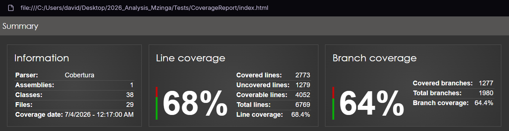

# Mzinga project analysis report

## Unit testing and code coverage

The **Mzinga** project utilizes the **MSTest** framework for its existing unit tests. Alongside the test framework, **Coverlet** is integrated as a cross-platform code coverage library for .NET. 

To streamline the execution and reporting of unit tests, a PowerShell script `run_tests.ps1` was created in the `Tests` directory. This script automates test discovery, runs tests with Coverlet code coverage data collection, and generates an HTML visual report using **ReportGenerator**.

The script accepts the following arguments:
- **Target**: Determines which tests to run.
  - `original`: Executes only the existing unit tests inside the `Mzinga/src` project.
  - `new`: Executes only the new tests added inside the `Tests` folder.
  - `all`: Executes both the original and new tests sequentially.
- **-Visualize**: If provided, it generates an HTML coverage report using ReportGenerator and automatically opens it in the default web browser. If Target argument is not provided, script will just visualize the last generated report, if it exists.

### Current coverage baseline

Before introducing additional unit tests to the codebase, it is crucial to establish the current test coverage baseline. We will run only the original tests and generate the visual report:

```powershell
.\Tests\run_tests.ps1 original -Visualize
```

[Image 1](#img1) displays general code coverage results, before introducing new tests. We can see that around two thirds of lines (68%) and branches (64%) are covered, which is a good start but can be improved.

<figure id="img1" style="text-align: center;">
  
  <figcaption>Image 1: Original code coverage general results</figcaption>
</figure>

[Image 2](#img2) shows detailed code coverage by main classes. We can see that main game and AI logic are covered with high coverage percentage. This includes `Mzinga.Core.Board` which covers board state, `Mzinga.Core.Move` which validates and executes moves, `Mzinga.Core.AI.GameAI` which implements algorithms for game AI, as well as some classes with 100% code coverage such as `PieceMetrics`.

On the other hand, there are classes that are not covered as much or not covered at all. The goal is to reach over 80% total code coverage. To achieve this, testing should focus on the following areas:

1. `Mzinga.Engine` namespace: Class `Mzinga.Engine.Engine` is not covered at all. Testing basic interactions, Universal Hive Protocol commands, and engine states is important. Furthermore, `Mzinga.Engine.EngineConfig` is only covered by 39.5%. Testing the parsing of default options, validations, and profile configs will also provide a significant coverage bump.
2. `Exception` classes: Exception classes such as `CommandException`, `GameOverException`, `NoBoardException` `PerfInvalidDepthException`, and `UndoInvalidNumberOfMovesException` have 0% coverage. This clearly shows that error handling and invalid state edge cases are currently not being verified by the test suite.
3. Core components with partial coverage: Classes like `Mzinga.Core.GameMetadata` (50% coverage) and `Mzinga.Core.AI.MetricWeights` (64.3% coverage) have gaps that are not tested.
4. Utility classes: Simple utility structures like `Mzinga.AppInfo`, `Mzinga.VersionUtils`, `Mzinga.Core.CacheMetricsSet` and `Mzinga.Core.MoveSet` currently have 0% coverage but require minimal effort to verify.

<figure id="img2" style="text-align: center;">
  
  <figcaption>Image 2: Original code coverage detailed results</figcaption>
</figure>
